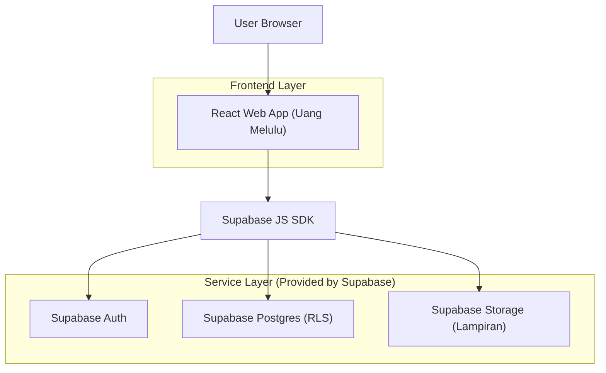
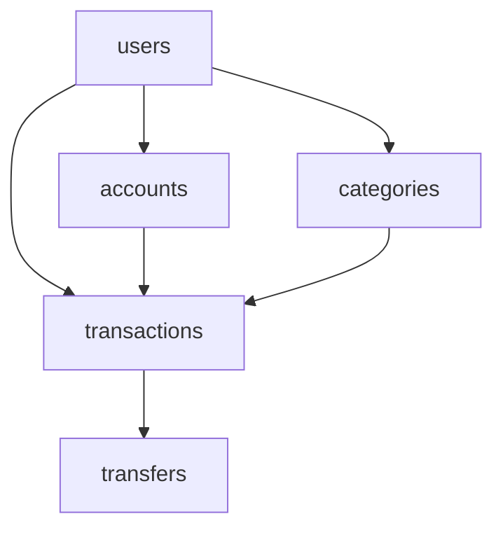

## 1.Architecture design


## 2.Technology Description
- Frontend: React@18 + TypeScript + vite + tailwindcss@3
- Routing: react-router-dom@6 (protected routes sebagai “middleware auth”)
- Forms/Validation: react-hook-form + zod (opsional namun disarankan)
- Backend: None (langsung via Supabase SDK dari frontend)
- Database/Auth/Storage: Supabase (PostgreSQL + RLS + Auth + Storage)

## 3.Route definitions
| Route | Purpose |
|-------|---------|
| /auth | Halaman Masuk/Daftar/Lupa Sandi |
| / | Redirect: jika login → /dashboard, jika belum → /auth |
| /dashboard | Beranda setelah login (ringkasan) |
| /transaksi | Daftar + pengelolaan transaksi |
| /laporan | Ringkasan analitik periode |
| /pengaturan | Profil, akun, kategori, logout |

## 4.Auth + “Middleware” (Route Guard)
- Definisi: “middleware” di sini adalah lapisan pemeriksaan sesi sebelum halaman private dirender.
- Implementasi: komponen `RequireAuth` (atau loader) yang:
  1) Membaca sesi dari Supabase (`getSession()`),
  2) Jika tidak ada sesi → redirect ke `/auth`,
  3) Jika ada sesi → render halaman.
- Session sync: pasang listener `onAuthStateChange` untuk menjaga state login (refresh, logout di tab lain).

## 5.Server architecture diagram
Tidak ada server aplikasi terpisah; semua akses data menggunakan Supabase (RLS membatasi akses per user).

## 6.Data model(if applicable)
### 6.1 Data model definition
Sumber skema utama sudah tersedia di `supabase_finance.sql`. Inti MVP yang dipakai UI:
- `users`: profil pengguna (terhubung ke `auth.users`)
- `accounts`: akun sumber dana + saldo
- `categories`: kategori pemasukan/pengeluaran (termasuk default global)
- `transactions`: pemasukan/pengeluaran/transfer + catatan + tanggal
- `transfers`: penghubung transaksi transfer (from/to)

Relasi ringkas:


### 6.2 Data Definition Language
Gunakan file migrasi yang ada (`supabase_finance.sql`) untuk DDL lengkap. Potongan inti (ringkas):
```
create table public.accounts (
  id uuid primary key default gen_random_uuid(),
  user_id uuid not null references public.users(id),
  name text not null,
  type account_type not null default 'bank',
  balance numeric(15,2) not null default 0,
  currency char(3) not null default 'IDR'
);

create table public.transactions (
  id uuid primary key default gen_random_uuid(),
  user_id uuid not null references public.users(id),
  account_id uuid not null references public.accounts(id),
  category_id uuid references public.categories(id),
  type transaction_type not null,
  amount numeric(15,2) not null check (amount > 0),
  note text,
  transaction_date date not null default current_date,
  attachment_url text
);
```

Catatan keamanan (sesuai praktik Supabase):
- Aktifkan RLS dan policy per-user (sudah ada di SQL).
- Grant minimal:
  - `GRANT SELECT ON [tabel] TO anon;`
  - `GRANT ALL PRIVILEGES ON [tabel] TO authenticated;`

## Struktur folder (rekomendasi)
- `src/`
  - `app/` (router, layout, protected route)
  - `pages/` (`AuthPage`, `DashboardPage`, `TransaksiPage`, `LaporanPage`, `PengaturanPage`)
  - `components/` (Navbar, SideNav, Card, Table, Modal/Drawer, FormField)
  - `features/` (`transactions`, `accounts`, `reports`, `settings`)
  - `lib/` (`supabaseClient`, formatter uang/tanggal)
  - `styles/` (tailwind base + token tema)
