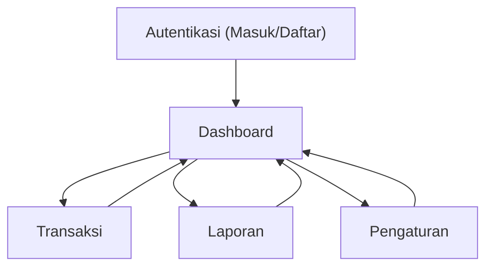

## 1. Product Overview
Uang Melulu adalah aplikasi web keuangan pribadi untuk mencatat pemasukan/pengeluaran, melihat saldo akun, dan membaca ringkasan laporan.
Targetnya: kamu bisa mengambil keputusan finansial harian dengan cepat dari satu dashboard.

## 2. Core Features

### 2.1 User Roles
| Role | Metode Registrasi | Core Permissions |
|------|-------------------|------------------|
| Pengguna | Daftar via Email + Password (Supabase Auth) | Kelola data keuangan milik sendiri (akun, kategori, transaksi, laporan), kelola profil & logout |
| Anggota Keluarga (opsional) | Diundang ke Grup Keluarga | Bisa melihat data sesuai kebijakan grup (minimal: baca transaksi yang dibagikan) |

### 2.2 Feature Module
Aplikasi ini terdiri dari halaman utama berikut:
1. **Autentikasi (Masuk/Daftar/Lupa Sandi)**: form auth, validasi, error state.
2. **Dashboard**: ringkasan saldo per akun, ringkasan bulan berjalan, grafik sederhana, tombol “Tambah Transaksi”.
3. **Transaksi**: daftar transaksi, filter, tambah/ubah/hapus, transfer antar akun, lampiran bukti (opsional).
4. **Laporan**: ringkasan periode, breakdown kategori, tren pemasukan vs pengeluaran.
5. **Pengaturan**: profil, kelola akun, kelola kategori, preferensi (mata uang/format), grup keluarga (opsional).

### 2.3 Page Details
| Page Name | Module Name | Feature description |
|-----------|-------------|---------------------|
| Autentikasi | Masuk | Memvalidasi email+password, menampilkan pesan error, mengarahkan ke Dashboard saat sukses |
| Autentikasi | Daftar | Membuat akun baru, menyiapkan profil pengguna otomatis, mengarahkan ke Dashboard |
| Autentikasi | Lupa Sandi | Mengirim email reset password dan menampilkan instruksi lanjutan |
| Dashboard | Ringkasan Saldo | Menampilkan kartu saldo per akun (nama, tipe, saldo) dan total saldo |
| Dashboard | Ringkasan Bulan Ini | Menghitung pemasukan, pengeluaran, dan selisih untuk periode bulan berjalan |
| Dashboard | Grafik Cepat | Menampilkan tren sederhana (harian/mingguan) pemasukan vs pengeluaran |
| Dashboard | Quick Action | Membuka form “Tambah Transaksi” (modal/drawer) dari mana pun |
| Transaksi | Daftar & Filter | Menampilkan daftar transaksi, mencari, memfilter berdasarkan tanggal, akun, kategori, tipe |
| Transaksi | Tambah/Ubah/Hapus | Membuat, mengubah, dan menghapus transaksi; melakukan validasi nominal>0 |
| Transaksi | Transfer | Membuat transfer antar akun (mencatat dua transaksi terhubung) |
| Transaksi | Lampiran Bukti (opsional) | Mengunggah dan menampilkan tautan bukti transaksi |
| Laporan | Pemilihan Periode | Mengubah rentang waktu (minggu/bulan/kustom) dan memuat ulang ringkasan |
| Laporan | Analitik Ringkas | Menampilkan total, pie/bar per kategori, dan daftar kategori teratas |
| Pengaturan | Profil | Mengubah nama tampilan, avatar, dan status aktif akun |
| Pengaturan | Akun | Menambah/mengubah/nonaktifkan akun, menampilkan saldo terkini |
| Pengaturan | Kategori | Menambah/mengubah kategori pribadi, memilih ikon/warna, dukung sub-kategori |
| Pengaturan | Keamanan | Logout dan menampilkan status sesi/login |
| Pengaturan | Grup Keluarga (opsional) | Membuat grup, mengundang/kelola anggota, mengatur peran owner/member |

## 3. Core Process
**Alur Pengguna**
1) Kamu membuka aplikasi → jika belum login kamu masuk ke halaman Autentikasi.
2) Kamu masuk/daftar → sistem membuat sesi login → diarahkan ke Dashboard.
3) Dari Dashboard kamu menambah transaksi cepat → transaksi tersimpan → saldo akun ter-update otomatis.
4) Kamu membuka Transaksi untuk koreksi/ubah/hapus dan melakukan filter.
5) Kamu membuka Laporan untuk melihat ringkasan periode dan kategori teratas.
6) Kamu membuka Pengaturan untuk mengelola akun/kategori dan logout.

